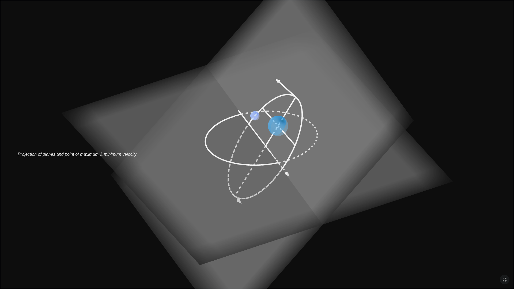
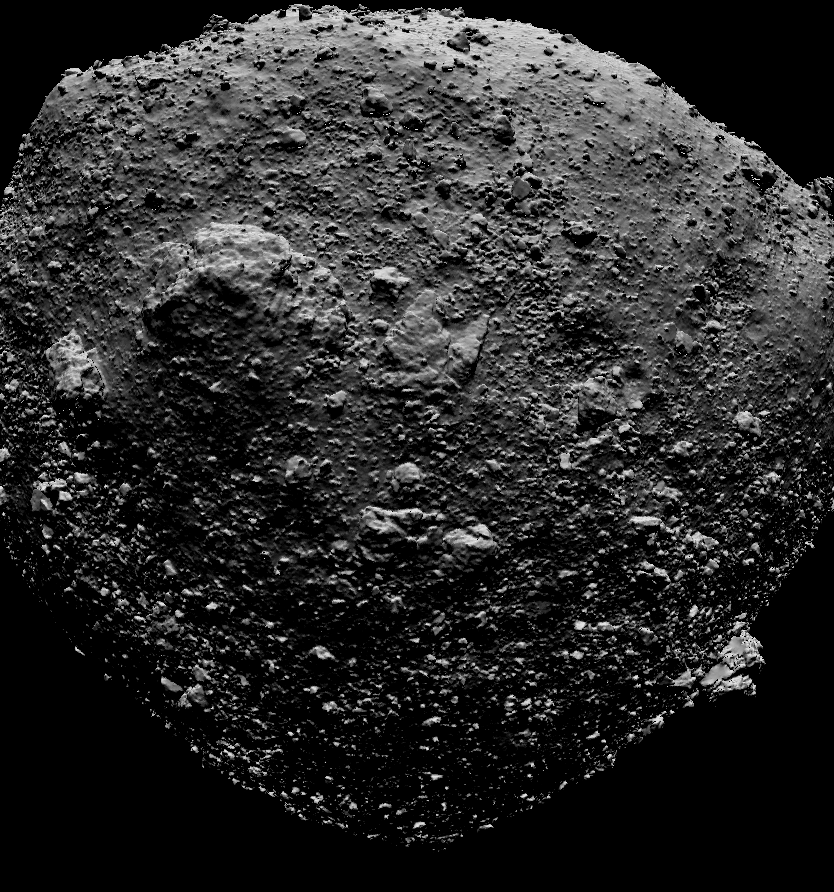

# Animations

## STEM Animations

This repository contains various animation files in multiple formats. These animations are designed to aid in STEM education and visualization.

### File Formats

- **.gbb**: Geogebra format (recommended)
- **.stl**: 3D rendered files with accompanying Python code
- **.html**: Hypertext format
- **.gif**: GIF with accompanying Python code (recommended)

### Examples

#### Geogebra Format (.gbb)


#### 3D Rendered Files (.gif)


### Usage

1. **Geogebra Files**:
   - Open the `.gbb` files using Geogebra software to explore interactive mathematical models.

2. **3D Rendered Files**:
   - Use a 3D viewer or software like Blender to open `.stl` files.
   - The accompanying Python code can be used to manipulate or generate these 3D models.

3. **HTML Files**:
   - Open the `.html` files in a web browser to view the animations.

4. 1. **GIF Files**:
   - Open the `.gif` files directly on your local device.

### Installation

For the Python code, ensure you have the necessary dependencies installed. You can install them using:

```bash
pip install -r requirements.txt